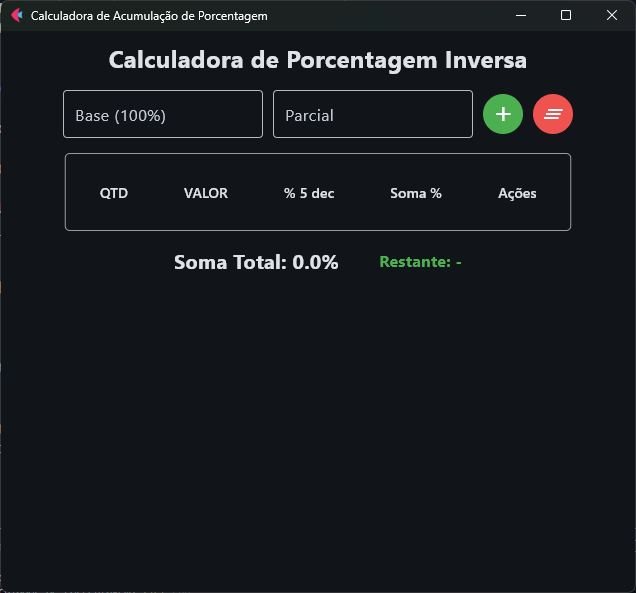

# Calculadora de Acumulação de Porcentagem

Uma ferramenta de desktop, construída com Python e Flet, para calcular e acumular porcentagens de forma interativa e detalhada. Ideal para cenários onde é preciso decompor um valor total em múltiplas partes e entender a contribuição percentual de cada uma.


*(Nota: Sugiro que você tire um print da sua aplicação e substitua o link acima pela imagem real)*

## 🚀 Sobre o Projeto

Esta não é uma calculadora de porcentagem comum. Ela foi projetada para resolver um problema específico: determinar qual porcentagem um valor parcial representa de um total e, mais importante, acumular múltiplas entradas parciais até que atinjam 100% do valor base.

É a ferramenta perfeita para planejamento financeiro, distribuição de custos, ou qualquer tarefa que exija uma visão clara de como as partes compõem um todo.

## ✨ Principais Funcionalidades

- **Cálculo de Porcentagem Inversa**: Insira um valor base (que representa 100%) e valores parciais para descobrir a porcentagem correspondente de cada um.
- **Acumulação de Valores**: A aplicação soma os valores parciais e os percentuais, exibindo o total acumulado em tempo real na tabela e em um painel de resumo.
- **Tabela de Entradas Detalhada**: Cada valor parcial adicionado é exibido em uma tabela organizada com:
  - **QTD**: Número sequencial da entrada.
  - **VALOR**: O valor parcial inserido.
  - **% 5 dec**: O percentual individual calculado com 5 casas decimais para alta precisão.
  - **Soma %**: O percentual acumulado de todas as entradas até aquele ponto.
  - **Ações**: Botão para excluir uma entrada específica.
- **Gestão de Entradas**: Adicione e remova entradas da tabela a qualquer momento. Os totais são recalculados automaticamente.
- **Copiar para a Área de Transferência**: Clique no valor de um percentual na tabela para copiá-lo instantaneamente. Um ícone de confirmação (`✓`) indica os valores já copiados, facilitando o uso dos dados em outros locais.
- **Cálculo de Valor Restante**: Visualize o valor que ainda falta para atingir o total base. O texto muda para a cor vermelha se o valor acumulado ultrapassar o total.
- **Validação e Feedback Visual**: A interface fornece feedback claro com mensagens de erro e destaques visuais (bordas vermelhas) para entradas inválidas, prevenindo erros de cálculo.
- **Bloqueio Inteligente**: O campo de valor base é bloqueado após a primeira entrada para garantir a consistência dos cálculos. A adição de novos valores é desativada automaticamente ao atingir 100% do total.
- **Limpeza Total**: Um botão para limpar todos os dados da sessão (entradas, totais e valor base) e reiniciar os cálculos com um único clique.

## 🛠️ Tecnologias Utilizadas

O projeto foi construído utilizando as seguintes tecnologias:

- **Python**: Linguagem de programação principal.
- **Flet**: Framework para a criação de aplicações multiplataforma (desktop, web, mobile) com Python.

## 📂 Estrutura do Projeto

O código fonte está organizado seguindo princípios de Clean Architecture para garantir separação de responsabilidades, testabilidade e manutenibilidade.

```
src/
├── core/
│   └── use_cases/      # Contém a lógica de negócio pura (ex: cálculo de porcentagem)
├── presentation/
│   └── views/          # Contém a lógica da interface do usuário e gestão de estado da UI
└── main.py             # Ponto de entrada da aplicação Flet
```

## 🏃 Como Executar o Projeto

Para executar a aplicação em sua máquina local, siga os passos abaixo:

1.  **Clone o repositório:**
    ```sh
    git clone https://github.com/ajbgdj/porcentagem_inverso.git
    cd porcentagem_inverso
    ```

2.  **Crie e ative um ambiente virtual** (recomendado):
    ```sh
    # Windows
    python -m venv .venv
    .venv\Scripts\activate
    ```

3.  **Instale as dependências:**
    O único requisito principal é o Flet.
    ```sh
    pip install flet
    ```

4.  **Execute a aplicação:**
    Você pode executar a aplicação de duas formas:
    ```sh
    # Usando o runner do Flet (recomendado)
    flet run src/main.py

    # Ou diretamente com Python
    python src/main.py
    ```
